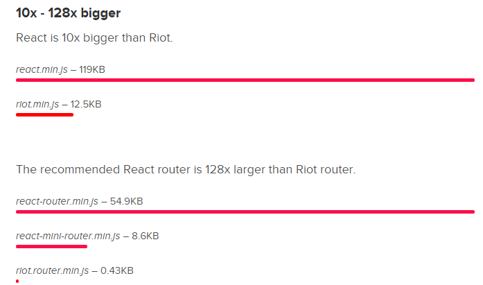
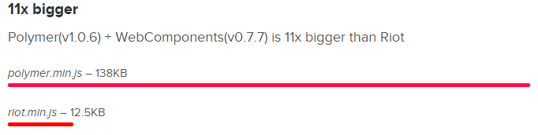

title: GitHub Pages  
author:  
  name: Mike Ward  
  twitter: mikeward_aa  
  url: http://mike-ward.net  
output: index.html  
style: style.css  
--
# RIOT
## A React-like user interface micro-library
## http://mike-ward.net/talk-riotjs

--
```javascript
<todo>
  <h3>{ opts.title }</h3>

  <ul>
    <li each={ item, i in items }>{ item }</li>
  </ul>

  <form onsubmit={ add }>
    <input>
    <button>Add #{ items.length + 1 }</button>
  </form>

  <style scoped>
    h3 { font-size: 14px; }
  </style>

  <script>
    this.items = []

    add(e) {
      var input = e.target[0]
      this.items.push(input.value)
      input.value = ''
    }
  </script>
</todo>
```
---
### Example To-Do Application

https://muut.github.io/riotjs/demo/


--
### Human Readable

Custom tags let you build complex views with HTML. Your application might look something like this:

```javascript
<body>

  <h1>Acme community</h1>

  <forum-header/>

  <forum-content>
    <forum-threads/>
    <forum-sidebar/>
  </forum-content>

  <forum-footer/>

  <script>riot.mount('*', { api: forum_api })</script>
</body>
```
--
### Before we go Further...

#### What is React and what problem is it trying to solve?


--
#### Recognize this?


--
### The Problem


--
### Lessons from React

- Always Re-Render Views
- Use a DOM abstraction
- Data flows in one direction
- Components Rule
--
### Size Matters



