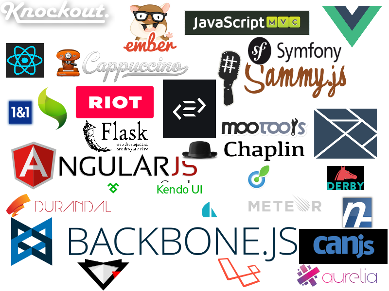
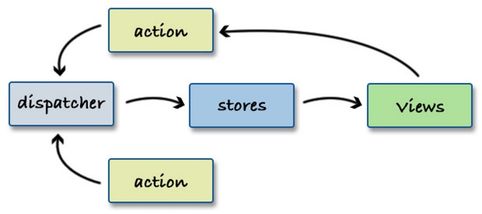

title: RIOTJS
author:
 name: Mike Ward
 twitter: mikeward_aa
 url: http://mike-ward.net
output: index.html
style: style.css

--

# RIOT
## A React-like user interface micro-library
## <http://mike-ward.net/talk-riotjs>

<!-- MDE -->

--

### Choices



--

``` js
<todo>
  <h3>{ opts.title }</h3>

  <ul>
    <li each="{ item, i in items }">{ item }</li>
  </ul>

  <form onsubmit="{ add }">
    <input>
    <button>Add #{ items.length + 1 }</button>
  </form>

  <style scoped>
    h3 { font-size: 14px; }
  </style>

  <script>
    this.items = []

    add(e) {
      var input = e.target[0]
      this.items.push(input.value)
      input.value = ''
    }
  </script>
</todo>
```

--


-- why

### Why a new UI Library?

#### Custom Tags

> A custom tag glues relevant HTML and JavaScript together forming a
> reusable component.

> Think React + Polymer but with enjoyable syntax and a small learning
> curve.

-- confused

### Human Readable

Custom tags let you build complex views with HTML

``` html
<body>

  <h1>Acme community</h1>

  <forum-header/>

  <forum-content>
    <forum-threads/>
    <forum-sidebar/>
  </forum-content>

  <forum-footer/>

  <script>riot.mount('*', { api: forum_api })</script>
</body>
```

--

### Virtual DOM

-   Absolutely the smallest possible amount of DOM updates and reflows

-   One way data flow: updates and unmounts are propagated downwards
    from parent to children

-   Expressions are pre-compiled and cached for high performance

-   Life-cycle events for more control

-   Server-side rendering of custom tags for universal (isomorphic)
    applications

--

### Close to Standards

-   No proprietary event system

-   The rendered DOM can be freely manipulated with other tools

-   No extra HTML root elements or data- attributes

-   Plays well with jQuery

--

### Tooling Friendly

-   Create tags with ES6, Typescript, CoffeeScript, Jade, LiveScript or
    any pre-processor you want

-   Integrate with NPM, CommonJS, AMD, Bower...

-   Develop with Gulp, Grunt, Browserify, WebPack...

-- learning-curve

### Small Learning Curve

Riot has between 10 and 100 times fewer API methods than other UI
libraries.

-   Less to learn. Fewer books and tutorials to view

-   Less proprietary stuff and more standard stuff

-- cloud-download

### Size

| Framework               | Version | Minified Size |
|-------------------------|---------|---------------|
| Ember                   | 1.13.3  | 493.3kb       |
| Angular                 | 1.4.2   | 145.5kb       |
| React                   | 0.14.1  | 132.6kb       |
| Web Components Polyfill | 0.7.5   | 117.1kb       |
| Polymer                 | 1.0.6   | 101.2kb       |
| Riot                    | 2.3.12  | 20kb          |

--

``` js
<todo>
  <h3>{ opts.title }</h3>

  <ul>
    <li each="{ item, i in items }">{ item }</li>
  </ul>

  <form onsubmit="{ add }">
    <input>
    <button>Add #{ items.length + 1 }</button>
  </form>

  <style scoped>
    h3 { font-size: 14px; }
  </style>

  <script>
    this.items = []

    add(e) {
      var input = e.target[0]
      this.items.push(input.value)
      input.value = ''
    }
  </script>
</todo>
```

--

### Use

``` html
<html>
  <head>
    <title>Hello Riot</title>
  </head>
  <body>
    <todo></todo>
    
    <script src="todo.tag" type="riot/tag"></script>
    <script src="js/riot+compiler.min.js"></script>
    <script>riot.mount('todo')</script>
  </body>
</html>
```

--

### Example To-Do Application

<http://riotjs.com/play/todo/>


--

### Compiler?

#### In-browser compilation

Custom tags need to be transformed to JavaScript so the browser can
execute them.

Do this by setting a `type="riot/tag"` attribute for script tags.

There's also a command line compiler

--

### &lt;todo&gt; Compiled

``` js
riot.tag2(
  'todo', 
  '<h3>{opts.title}</h3> ...', 
  'todo h3,[riot-tag="todo"] h3 { font-size: 14px; }',
  '',  
  function(opts) {
    this.items = []

    this.add = function(e) {
      var input = e.target[0]
      this.items.push(input.value)
      input.value = ''
    }.bind(this)
  }, 
'{ }');
```

--

### Compiler performance

Compilation phase is basically free and takes no time at all

Compiling the `todo` tag 30 times takes 2 milliseconds on a regular
laptop.

1000 different todo-sized tags, the compilation takes around 35ms

The compiler weighs only 3.2KB (1.7K gzipped)

--

### Before we go Further...

#### What is React and what problem is it trying to solve?


--

#### Recognize this?


--

### The Problem


--

### Not Predictable


--

### A Solution


--

### React Component

``` js
var Timer = React.createClass({
  getInitialState: function() {
    return {secondsElapsed: 0};
  },
  tick: function() {
    this.setState({secondsElapsed: this.state.secondsElapsed + 1});
  },
  componentDidMount: function() {
    this.interval = setInterval(this.tick, 1000);
  },
  componentWillUnmount: function() {
    clearInterval(this.interval);
  },
  render: function() {
    return (
      <div>Seconds Elapsed: {this.state.secondsElapsed}</div>
    );
  }
});

ReactDOM.render(<Timer />, mountNode);
```

--

### But won't this be...


--

### Virtual DOM


--

### Flux



-- lessons-learned

### Lessons from React

-   Render views straight-up

-   Use a DOM abstraction

-   Data flows in one direction

-   Components Rule

--

### Difference between Riot and React

The most significant difference lies in how the UI markup templates are
declared:

-   In React the UI template markup is baked in your JavaScript source
    (using the JSX language extension)

-   Riot inverts the React model by putting the markup and logic in an
    HTML (tag) file


--

### RIOT Syntax


--

### Tag Syntax

A Riot tag is a combination of layout (HTML) and logic (JavaScript).
Here are the basic rules:

-   HTML is defined first and the logic is enclosed inside an optional
    `<script>` tag

-   Custom tags can be empty, HTML only or JavaScript only

-   All attribute names must be lowercase

-   A shorthand syntax for class names is available:

    `class={ completed: done }`

    renders to `class="completed"` when the value of `done` is a true
    value

--

### Tag Styling

You can put a style tag inside. Riot.js automatically takes it out and
injects it into `<head>`

``` js
<todo>

  <!-- layout -->
  <h3>{ opts.title }</h3>

  <style>
    todo { display: block }
    todo h3 { font-size: 120% }
    /** other tag specific styles **/
  </style>

</todo>
```

--

### Scoped CSS

Scoped CSS is also available.

``` js
<todo>

  <!-- layout -->
  <h3>{ opts.title }</h3>

  <style scoped>
    :scope { display: block }
    h3 { font-size: 120% }
    /** other tag specific styles **/
  </style>

</todo>
```

--

### Pre-Proccesor

You can specify a pre-processor with type attribute

``` js
<my-tag>
  <script type="coffee">
    # your coffeescript logic goes here
  </script>
</my-tag>
```

Other options: “coffee”, “typescript”, “es6” and “none”

--

### Mounting

Once a tag is defined you can mount it on the page as follows:

``` html
<body>

  <!-- place the custom tag anywhere inside the body -->
  <todo></todo>

  <!-- include riot.js -->
  <script src="riot.min.js"></script>

  <!-- include the tag -->
  <script src="todo.js" type="riot/tag"></script>

  <!-- mount the tag -->
  <script>riot.mount('todo')</script>

</body>
```

--

### Examples of Mounting

``` js
// mount all custom tags on the page
riot.mount('*')

// mount an element with a specific id
riot.mount('#my-element')

// mount selected elements
riot.mount('todo, forum, comments')
```

--

### riot.observable(el)

Adds Observer support for the given object `el`

```js
function Car() {

  // Make Car instances observable
  riot.observable(this)

  // listen to 'start' event
  this.on('start', function() {
    // engine started
  })

}

// make a new Car instance
var car = new Car()

// trigger 'start' event
car.trigger('start')
```

--

### Life Cycle Events

Custom tags are instances of `riot.observable`

``` js
this.on('before-mount', function() {
  // before the tag is mounted
})
this.on('mount', function() {
  // right after the tag is mounted on the page
})
this.on('update', function() {
  // allows recalculation of context data before the update
})
this.on('updated', function() {
  // right after the tag template is updated
})
this.on('before-unmount', function() {
  // before the tag is removed
})
this.on('unmount', function() {
  // when the tag is removed from the page
})
// curious about all events ?
this.on('all', function(eventName) {
  console.info(eventName)
})
```

--

### Event Example

``` js
<example-tag>
  <p id="findMe">Do I even Exist?</p>

  <script>
  var test1 = document.getElementById('findMe')
  console.log('test1', test1)  // Fails

  this.on('update', function(){
    var test2 = document.getElementById('findMe')
    console.log('test2', test2) // Succeeds, fires on every update
  })

  this.on('mount', function(){
    var test3 = document.getElementById('findMe')
    console.log('test3', test3) // Succeeds, fires once (per mount)
  })
  </script>
</example-tag>
```

--

### Options

``` js
<script>
riot.mount('todo', { title: 'My TODO app', items: [ ... ] })
</script>
```

Inside the tag the options can be referenced with `opts`

``` js
<my-tag>

  <!-- Options in HTML -->
  <h3>{ opts.title }</h3>

  // Options in JavaScript
  var title = opts.title

</my-tag>
```

--

### Expressions

HTML can be mixed with expressions that are enclosed in curly braces

``` js
{ /* my_expression goes here */ }
```

Expressions can set attributes or nested text nodes

``` js
<h3 id={ /* attribute_expression */ }>
  { /* nested_expression */ }
</h3>
```

Expressions are 100% JavaScript

``` js
{ title || 'Untitled' }
{ results ? 'ready' : 'loading' }
{ new Date() }
{ message.length > 140 && 'Message is too long' }
{ Math.round(rating) }
```

--

### Boolean Attributes

Boolean attributes (checked, selected etc..) are ignored when the
expression value is falsy

``` js
<input checked={ null }> becomes <input>.
```

W3C states a boolean property is true if the attribute is present

The following expression does not work

``` js
<input type="checkbox" { true ? 'checked' : ''}>
```

--

### Class Shorthand

Riot has a special syntax for CSS class names

``` js
<p class={ foo: true, bar: 0, baz: new Date(), zorro: 'a value' }>
</p>
```

Property names with truthy values are appended to class names

--

### Transclusion

> The inclusion of part of one hypertext document in another one by
> means of reference rather than copying

``` js
<my-tag>
  <p>Hello <yield/></p>
  this.text = 'world'
</my-tag>
```

Usage

``` js
<my-tag>
  <b>{ text }</b>
</my-tag>
```

Result

``` js
<my-tag>
  <p>Hello <b>world</b><p>
</my-tag>
```

--

### Multi-transclusion

The `<yield>` tag also provides a slot mechanism that allows you to
inject html contents on specific slots in the template

For example using the following riot tag `my-other-post`

``` js
<my-other-post>
  <article>
    <h1>{ opts.title }</h1>
    <h2><yield from="summary"/></h2>
    <div>
      <yield from="content"/>
    </div>
  </article>
</my-other-post>
```

--

### Multi-transclusion (usage)

``` js
<my-other-post title="What a great title">
  <yield to="summary">
    My beautiful post is just awesome
  </yield>
  <yield to="content">
    <p>And the next paragraph describes just how awesome it is</p>
    <p>Very</p>
  </yield>
</my-other-post>
```

--

### Loops

``` js
<todo>
  <ul>
    <li each={ items } class={ completed: done }>
      <input type="checkbox" checked={ done }> { title }
    </li>
  </ul>

  this.items = [
    { title: 'First item', done: true },
    { title: 'Second item' },
    { title: 'Third item' }
  ]
</todo>
```

Element with the `each` attribute repeated for all items in array

--

### Non-object arrays

The array elements need not be objects. They can be strings or numbers
as well. Use the `{ name, i in items }`

``` js
<my-tag>
  <p each="{ name, i in arr }">{ i }: { name }</p>

  this.arr = [ true, 110, Math.random(), 'fourth']
</my-tag>
```

--

### Object loops

``` js
<my-tag>
  <p each="{ name, value in obj }">{ name } = { value }</p>

  this.obj = {
    key1: 'value1',
    key2: 1110.8900,
    key3: Math.random()
  }
</my-tag>
```

*Object loops are not recommended*

--

### Other Stuff

-   Observable

-   Routing

But first ... **An Example**

--

### Example

<https://github.com/mike-ward/talk-riotjs>

-   Routers and observables

-   Tooling (Webpack and NPM)

-   My lame attempt at an iTunes browser

-- online-resources

### Resources

-   [Riot Control](https://github.com/jimsparkman/RiotControl)

-   [Material UI](http://kysonic.github.io/riot-mui/)

-   [Riot Bootstrap](http://cognitom.github.io/riot-bootstrap/)

-   [RiotGear](https://riotgear.js.org/)

-   [WindyTy.com](http://windyty.com)


