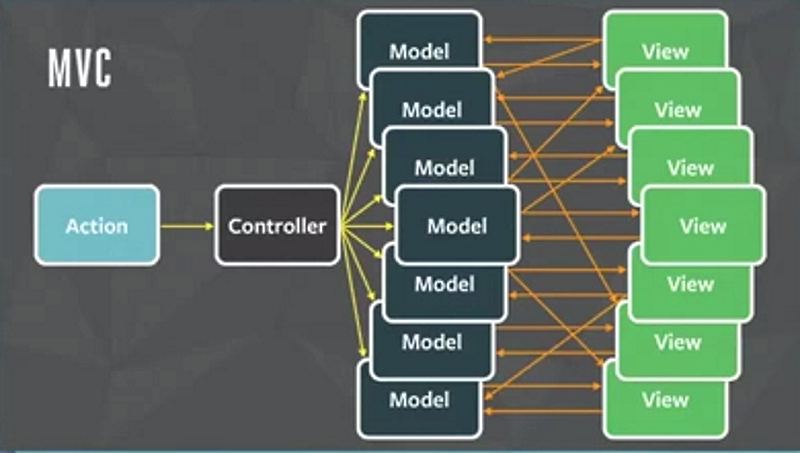

title: GitHub Pages  
author:  
  name: Mike Ward  
  twitter: mikeward_aa  
  url: http://mike-ward.net  
output: index.html  
style: style.css  
--
# RIOT
## A React-like user interface micro-library
## http://mike-ward.net/talk-riotjs

--


--
```js
<todo>
  <h3>{ opts.title }</h3>

  <ul>
    <li each="{ item, i in items }">{ item }</li>
  </ul>

  <form onsubmit="{ add }">
    <input>
    <button>Add #{ items.length + 1 }</button>
  </form>

  <style scoped>
    h3 { font-size: 14px; }
  </style>

  <script>
    this.items = []

    add(e) {
      var input = e.target[0]
      this.items.push(input.value)
      input.value = ''
    }
  </script>
</todo>
```
--
### Why a new UI Library?

-   In a word (well two words), **Custom Tags**

-   Want enjoyable syntax

-   HTML syntax is the de facto language of the web and it’s designed for 
    building user interfaces. 

-   HTML syntax is explicit, nesting is inherent to the language, and 
    attributes offer a clean way to provide options for custom tags.

--
### Virtual DOM

-   Absolutely the smallest possible amount of DOM updates and reflows

-   One way data flow: updates and unmounts are propagated downwards 
    from parent to children

-   Expressions are pre-compiled and cached for high performance

-   Lifecycle events for more control

-   Server-side rendering of custom tags for universal 
    (isomorphic) applications

--
### Close to Standards

-   No proprietary event system

-   The rendered DOM can be freely manipulated with other tools

-   No extra HTML root elements or data- attributes

-   Plays well with jQuery

--
### Tooling Friendly

-  Create tags with ES6, Typescript, CoffeeScript, Jade, LiveScript or 
   any pre-processor you want
   
-  Integrate with NPM, CommonJS, AMD, Bower or Component

-  Develop with Gulp, Grunt or Browserify plugins

--
### Small Learning Curve

Riot has between 10 and 100 times fewer API methods than other UI libraries.

-  Less to learn. Fewer books and tutorials to view

-  Less proprietary stuff and more standard stuff

--
### Size Matters

| Framework	              | Version	| Minified Size |
|------------------------ | ------- | ------------- |
| Ember	                  | 1.13.3	| 493.3kb       |
| Angular	                | 1.4.2	  | 145.5kb       |
| React	                  | 0.14.1	| 132.6kb       |
| Web Components Polyfill	| 0.7.5   |	117.1kb       |
| Polymer	                | 1.0.6	  | 101.2kb       |
| Riot	                  | 2.3.11	| 18kb          |

--
```js
<todo>
  <h3>{ opts.title }</h3>

  <ul>
    <li each="{ item, i in items }">{ item }</li>
  </ul>

  <form onsubmit="{ add }">
    <input>
    <button>Add #{ items.length + 1 }</button>
  </form>

  <style scoped>
    h3 { font-size: 14px; }
  </style>

  <script>
    this.items = []

    add(e) {
      var input = e.target[0]
      this.items.push(input.value)
      input.value = ''
    }
  </script>
</todo>
```

---
### Example To-Do Application

<http://riotjs.com/play/todo/>


--
### Human Readable

Custom tags let you build complex views with HTML. Your application might look something like this:

```xml
<body>

  <h1>Acme community</h1>

  <forum-header/>

  <forum-content>
    <forum-threads/>
    <forum-sidebar/>
  </forum-content>

  <forum-footer/>

  <script>riot.mount('*', { api: forum_api })</script>
</body>
```
--
### Before we go Further...

#### What is React and what problem is it trying to solve?


--
#### Recognize this?


--
### The Problem



--
### Lessons from React

- Always Re-Render Views
- Use a DOM abstraction
- Data flows in one direction
- Components Rule

---
### Difference between Riot and React

The most significant difference lies in how the UI markup templates are declared:

-   In React the UI template markup is baked in your JavaScript source 
    (using the JSX language extension).

-   Riot inverts the React model by putting the markup and logic in an 
    HTML (tag) file.

-   Riot tags are converted to pure JavaScript so browsers can execute them.   

